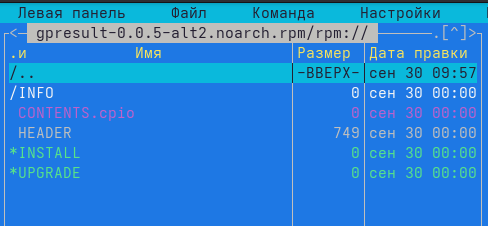

- [Введение](#введение)
- [Менеджеры пакетов в Linux](#менеджеры-пакетов-в-linux)
  - [Виды пакетов](#виды-пакетов)
  - [Средства управления RPM пакетами в ALT Linux](#средства-управления-rpm-пакетами-в-alt-linux)
    - [APT](#apt)
    - [RPM](#rpm)
- [RPM-пакеты](#rpm-пакеты)
  - [Подготовка окружения перед сборкой пакета](#подготовка-окружения-перед-сборкой-пакета)
  - [SPEC файл](#spec-файл)
    - [Преамбула](#преамбула)
    - [Макросы](#макросы)
    - [Как написать SPEC файл](#как-написать-spec-файл)
- [Инструменты для создания RPM пакетов](#инструменты-для-создания-rpm-пакетов)
  - [Gear](#gear)
  - [Hasher](#hasher)
- [Полезные ссылки](#полезные-ссылки)

# Введение
Рассказ пойдет об RPM-пакетах в ОС ALT Linux. Сначала затрагивается тема менеджеров пакетов в Linux (какие есть средства, предназначение, полезные команды). Затем более подробно описывается структура RPM-пакета, SPEC-файл, а также сборочные инструменты. После чего приводится практический пример сборки пакета.

# Менеджеры пакетов в Linux

В далекие времена установка программного обеспечения под операционные системы семейства Linux могла серьезно напугать начинающих пользователей этих операционных систем. Загрузка исходников, борьба с зависимостями, ручная правка конфигов и другие "прелести" установки приложений того времени сейчас покажутся глубоким анахронизмом.

Сейчас дистрибутивы Linux имеют в своем составе возможность установки программного обеспечения с помощью **менеджеров пакетов**.

**Системы управления пакетами (пакетный менеджер)** — это набор программного обеспечения, позволяющего управлять процессом установки, удаления, настройки и обновления различных компонентов ПО.

## Виды пакетов
Различные дистрибутивы ОС Linux имеют свои форматы пакетов. Вот основные форматы:
- `.deb` – Debian и производные (Ubuntu, Mint и т.д.)
- `.rpm` – Red Hat и производные (CentOS, Fedora и т.д.), OpenSUSE
- `.apk` – Android
- `.ebuild` – Gentoo

В операционных системах ALT Linux используется формат пакетов `.rpm`, про его особенности будет сказано далее.

## Средства управления RPM пакетами в ALT Linux
В ALT Linux используется пакетный менеджер `RPM`, являющийся "низкоуровневым" инструментом. А так же утилита `APT` - высокоуровневая обвзяка над RPM, позволяющая манипулировать пакетами из репозиториев.

### APT
В ALT Linux для управления пакетами используется утилита **APT** (Advanced Package Tool).

Все пакеты, из которых в систему ставятся программы, хранятся в специальных сетевых хранилищах - репозиториях. Они состоят из двух частей - индексов и хранилища. Сначала получаются файлы индексов, содержащие список всех пакетов и ссылки на них и, используя полученные индексы, пакеты скачиваются из хранилища во временный каталог и, по завершении загрузки, устанавливаются в систему или обновляются.

С помощью команд apt мы можем (часто используемые команды):
| Команда | Описание | Заметки |
|----------|----------|----------|
| `# apt-get update`    | Получить индексы   | После выполнения команды, `apt` обновит свой кеш новой информацией. |
| `# apt-get dist-upgrade`    | Обновить все установленные пакеты   | Обновление не затрагивает ядро |
| `# apt-get install имя_пакета`    | Установить новые пакеты   | Зависимости установятся автоматически. Можно указать несколько пакетов через пробел |
| `# apt-get remove имя_пакета`    | Удалить установленные пакеты   | - |
| `# apt-get clean`    | Очистить кеш   | Все устанавливаемые или обновляемые пакеты хранятся на диске в `/var/cache/apt/archives`. Чтобы директория не занимала все больше и больше места, нужно выполнять очистку диска от старых установленных пакетов|
| `$ apt-cache search часть_названия`    | Найти пакеты в репозитории   | `apt-cache` - инструмент для поиска и извлечения полезной информации из индекса подключенных репозиториев, получаемого командой apt-get update |
| `$ apt-cache showpkg имя_пакета`    | Вывод списка установленных пакетов, непосредственно зависящих от указанного   | -|


### RPM
**RPM (Red Hat Package Manager)** — семейство пакетных менеджеров, применяемых в различных дистрибутивах GNU/Linux, в том числе и в проекте Sisyphus и в дистрибутивах ALT Linux.

Практически каждый крупный проект, использующий RPM, имеет свою версию пакетного менеджера, отличающуюся от остальных.

Основные отличия RPM в Альт и Сизиф от RPM других крупных проектов заключаются в следующем:
* обширный набор макросов для сборки различных типов пакетов (*в практической части приведено сравнение*)
* отличающееся поведение «по умолчанию» для уменьшения количества шаблонного кода в .spec-файлах
* наличие механизмов для автоматического поиска межпакетных зависимостей
* наличие так называемых set-version зависимостей (начиная с 4.0.4-alt98.46 ),обеспечивающих дополнительный контроль за изменением ABI библиотек

Основные команды `rpm`:
| Команда | Описание | Заметки |
|----------|----------|----------|
| `$ rpm -qip имя_пакета.rpm`    | Получить информацию о пакете без установки   | Ключ `-p (-package)` работает не с базой RPM-пакетов, а с конкретным пакетом |
| `$ rpm -qi имя_пакета`    | Получить информацию об установленном пакете  | - |
| `# rpm -ivh имя_пакета.rpm`    | Установить `rpm` пакет | Ключи `-v` и `-h `не влияют на установку, а служат для вывода наглядного процесса сборки в консоль. Ключ `-v` (verbose) выводит детальные значения. Ключ `-h` (hash) выводит "#" по мере установки пакета. |
| `$ rpm -ql имя_пакета`    | Просмотр файлов установленного в систему пакета  | - |
| `$ rpm -qa --last\|head`    | Просмотр недавно установленных пакетов  | - |
| `$ rpm -Uvh имя_пакета.noarch.rpm`    | Обновление пакета  | - |

# RPM-пакеты
После обзора средств управления rpm-пакетами перейдем к структуре самого пакета.

**RPM-пакет** - это архив, содержащий в себе архив `.cpio` с файлами, а также метаданные - имя пакета, его описание, зависимости и т.д. Менеджер пакетов RPM использует эти метаданные для проверки наличия необходимых пакетов из списка зависимостей, исполнения инструкций по установке файлов и сохранения общей информации о пакете у себя в базе.

<p align="center">
    
</p>

Существует два типа RPM-пакетов:
1. **SRPM-пакеты** (исходники) - архив с расширением `.src.rpm`. SRPM содержит исходный код, при необходимости патчи к нему и spec-файл, в котором описывается, как собрать исходный код в RPM-пакет.

<p align="center">
    
</p>

1. **RPM-пакеты** - архив с расширением `.rpm`. RPM содержит исполняемые файлы и библиотеки:
```
[alekseevamo@lenovo-93812 usr]$ tree usr
usr
├── bin
│   └── gpresult
├── lib
│   └── python3
│       └── site-packages
│           ├── gpresult
│           │   ├── <исходные файлы проекта>
│           │   ...
│           │   
│           └── gpresult-0.0.4.dist-info
│               ├── entry_points.txt
│               └── METADATA
└── share
    └── bash-completion
        └── completions
            └── gpresult
```

## Подготовка окружения перед сборкой пакета
Перед тем, как перейти к непосредственной сборке RPM-пакета, необходимо подготовить окружение:
- установить **необходимые пакеты** (`gcc rpm-build rpmlint make python gear hasher patch rpmdevtools`)
- создать **рабочее пространство** для сборки RPM-пакетов, то есть создать дерево каталогов, которое является рабочей областью сборки RPM-пакетов.
  Для этого можно использовать утилиту `rpmdev-setuptree` или создать вручую, используя `mkdir`:
  ```
  $ rpmdev-setuptree

  $ tree ~/RPM/
  /home/SMB.BASEALT.RU/alekseevamo/RPM/
  |-- BUILD
  |-- RPMS
  |-- SOURCES
  |-- SPECS
  |-- SRPMS
  ```

  Описание созданных каталогов:
  | Каталог | Назначение |
  |----------|----------|
  | **BUILD**     | Содержит все файлы, которые появляются при сборке пакета|
  | **RPMS**      | Здесь формируются собранные RPM-пакеты (`.rpm`) в подкаталогах для разных архитектур, например, в подкаталогах`x86_64` и `noarch`|
  | **SOURCES**   | Здесь находятся архивы исходного кода и патчи. Утилита ``rpmbuild`` ищет их здесь.|
  | **SPECS**     | Здесь хранятся spec-файлы|
  | **SRPMS**     | Здесь находятся пакеты с исходниками (`.src.rpm`)|

- отредактировать файл `~/home/.rpmmacros`. Нужно указать, кто упаковывает пакеты:
```
$ cat .rpmmacros 
%_topdir	%homedir/RPM
#%_tmppath	%homedir/tmp

 %packager	Maria Alexeeva <alxvmr@altlinux.org>
# %_gpg_name	joe@email.address
```

## SPEC файл
**Spec-файл** можно рассматривать как "инструкцию", которая используется для фактической сборки RPM-пакета. Он сообщает системе сборки, что делать, определяя инструкции в серии разделов (в качестве примера взят пакет `gpresult`):
```
%add_python3_req_skip gpresult.Preferences.Preferences.Drive
%add_python3_req_skip gpresult.Preferences.Preferences.EnvVar
%add_python3_req_skip gpresult.Preferences.Preferences.File
%add_python3_req_skip gpresult.Preferences.Preferences.Folder
%add_python3_req_skip gpresult.Preferences.Preferences.Inifile
%add_python3_req_skip gpresult.Preferences.Preferences.Networkshare
%add_python3_req_skip gpresult.Preferences.Preferences.Shortcut

Name: gpresult
Version: 0.0.4
Release: alt1

Summary: Display applied policies
License: GPLv3+
Group: Other
Url: https://gitlab.basealt.space/alt/gpresult
BuildArch: noarch

BuildRequires: rpm-build-python3
BuildRequires: python3(wheel), python3(hatchling), python3(prettytable)
Requires: libgvdb-gir gpupdate >= 0.11.0

Source0: %name-%version.tar

%description
gpresult is used to get the result set of Group Policies that apply to a user and/or computer in domain.
The utility allows you to display a list of domain  (GPO) policies that apply to the computer and user.

%prep
%setup -q

%build
%pyproject_build

%install
%pyproject_install
install -Dm0644 completions/%name %buildroot/%_datadir/bash-completion/completions/%name

%files
%python3_sitelibdir/%name
%python3_sitelibdir/%name/locales
%python3_sitelibdir/%name-%version.dist-info
%_bindir/%name
%_datadir/bash-completion/completions/%name
%exclude %python3_sitelibdir/%name/locales/en_US/LC_MESSAGES/*.po
%exclude %python3_sitelibdir/%name/locales/ru_RU/LC_MESSAGES/*.po

%changelog
* Fri Jan 31 2025 Maria Alexeeva <alxvmr@altlinux.org> 0.0.4-alt1
- Added translations for argparse and fixed typos (Closes: #52282)
- Removed repetitions when using the -l and -lr options (Closes: #52878)
- Added --width key to bash completions
```
### Преамбула
```
Name: gpresult
Version: 0.0.4
Release: alt1

Summary: Display applied policies
License: GPLv3+
Group: Other
Url: https://gitlab.basealt.space/alt/gpresult
BuildArch: noarch

BuildRequires: rpm-build-python3
BuildRequires: python3(wheel), python3(hatchling), python3(prettytable)
Requires: libgvdb-gir gpupdate >= 0.11.0

Source0: %name-%version.tar
```
Выше выделена преамбула из .spec файла. Имеющиеся элементы:
| SPEC Директива | Определение |
|----------|----------|
| ``Name``          | Базовое имя пакета, которое должно совпадать с именем spec-файла
| ``Version``       | Версия upstream-кода
| ``Release``       | Релиз пакета используется для указания номера сборки пакета при данной версии upstream-кода. Как правило, установите начальное `alt1`  и увеличивайте его с каждым новым выпуском пакета, например: alt1, alt2, alt3 и т.д. Сбросьте значение до alt1 при создании новой версии программного обеспечения
| ``Summary``       | Краткое, в одну строку, описание пакета
| ``License``       | Лицензия на собираемое программное обеспечение
| ``Group``         | Используется для указания категории, к которой относится пакет. Указанная группа должна находиться в списке групп, известном RPM. Этот список располагается в файле /usr/lib/rpm/GROUPS, идущим вместе с пакетом rpm
| ``URL``           | Полный URL-адрес для получения дополнительной информации о программе. Чаще всего это ссылка на *GitHub* upstream-проекта для собираемого программного обеспечения
| ``Source0``       | Путь или URL-адрес к сжатому архиву исходного кода. Этот раздел должен указывать на доступное и надежное хранилище архива, например, на upstream-страницу, а не на локальное хранилище сборщика. При необходимости можно добавить дополнительные исходные директивы, каждый раз увеличивая их количество, например: Source1, Source2, Source3 и так далее
| ``BuildRequires`` | Разделённый запятыми или пробелами список пакетов, необходимых для сборки программы. Может быть несколько записей ``BuildRequires``, каждая в отдельной строке в SPEC файле.
| ``Requires`` | Разделённый запятыми или пробелами список пакетов, необходимых программному обеспечению для запуска после установки. Это его *зависимости* Может быть несколько записей ``Requires``, каждая в отдельной строке в SPEC файле

**Не вошедшие элементы:**
| SPEC Директива | Определение |
|----------|----------|
| ``Patch0``        | Название первого патча, который при необходимости будет применен к исходному коду. При необходимости можно добавить дополнительные директивы PatchX, увеличивая их количество каждый раз, например: Patch1, Patch2, Patch3 и так далее
| ``BuildArch``     | Если пакет не зависит от архитектуры, например, если он полностью написан на интерпретируемом языке программирования, установите для этого значение ``BuildArch: noarch``. Если этот параметр не задан, пакет автоматически наследует архитектуру компьютера, на котором он собран, например ``x86_64``
| ``ExcludeArch``   | Если часть программного обеспечения не может работать на определенной архитектуре процессора, Вы можете исключить эту архитектуру здесь
|``Conflicts``| Разделенный запятыми или пробелами список пакетов, с которыми конфликтует данный пакет |
|``Provides ``|Используется для указания того факта, что данный пакет предоставляет функциональность иного (переименованного устаревшего названия, широко известного по другим дистрибутивам либо же виртуального). Следует применять только в случае реальной необходимости и, как правило, в форме `Provides: something = %version-%release`. При переименовании пакета обязательно сочетается с `Obsoletes`|
|`Obsoletes`|Перечисляет пакеты/версии, объявленные устаревшими. Обычно применяется при переименовании пакета в сочетании с Provides и с указанием версии, меньшей или равной последней известной версии пакета под старым названием|

> [!WARNING]
> Каждая директива разделяется от ее значения символом «:». Между директивой и
двоеточием не должно быть пробелов!

После преамбулы идут секции `.spec` файла:
| SPEC Директива | Определение |
|----------|----------|
| ``%description`` | Полное описание программного обеспечения, входящего в комплект поставки RPM. Это описание может занимать несколько строк и может быть разбито на абзацы
| ``%prep``        | Команда или серия команд для подготовки программного обеспечения к сборке, например, распаковка архива из Source0. Эта директива может содержать сценарий оболочки (shell скрипт)
| ``%build``       | Команда или серия команд для фактической сборки программного обеспечения в машинный код (для скомпилированных языков) или байт-код (для некоторых интерпретируемых языков)
| ``%install``     | Раздел, который во время сборки пакета эмулирует конечные пути установки файлов в систему. Команда или серия команд для копирования требуемых артефактов сборки из ``%builddir`` (где происходит сборка) в``%buildroot`` каталог (который содержит структуру каталогов с файлами, подлежащими сборке). Обычно это означает копирование файлов из ``~/rpmbuild/BUILD`` в ``~/rpmbuild/BUILDROOT`` и создание необходимых каталогов ``~/rpmbuild/BUILDROOT``.  Это выполняется только при создании пакета, а не при установке пакета конечным пользователем
| ``%check``       | Команда или серия команд для тестирования программного обеспечения. Обычно включает в себя такие вещи, как модульные тесты
| ``%files``       | Список файлов, которые будут установлены в системе конечного пользователя
| ``%changelog``   | Запись изменений, произошедших с пакетом между различными ``Version`` или ``Release`` сборками

### Макросы
**Макросы RPM** — это прямые текстовые подстановки, которые происходят путем замены определенных выражений и условий на соответствующий текст во время процесса сборки пакета. Имена макросов начинаются с символа %. Они представляют собой сокращенные псевдонимы для часто используемых фрагментов текста.

Для чего нужны макросы:

- **Обеспечить желаемую функциональность**: Пакеты в репозитории Сизиф должны отвечать определённым правилам, для этого spec-файлы должны обеспечивать выполнение этих правил.
- **Помощь разработчику**: spec-файлы пишут люди, следовательно, их работу нужно свести к минимуму, который и требует участия человека. Майнтейнер не должен копировать блоки кода из файла в файл, так как данная работа занимает время, силы, и чревата ошибками. Для таких случаев существуют макросы. Если какой-то код появляется в разных spec-файлах более одного раза, то надо написать макрос(ы).
- **Сделать spec-файлы более читабельными**: Людям, пересобирающим пакет, или собирающим новый аналогичный пакет, опираясь на другие spec-файлы, будет удобнее, если в наименовании, расположении и использовании различных элементов spec-файлов будет определенный порядок.

Команды для работы с макросами:
| Команда | Определение |
|----------|----------|
|`rpm --showrc`|Посмотреть список доступных макросов|
|`rpm --eval %макрос`|Посмотреть значение конкретного макроса|

### Как написать SPEC файл
Напишем "Hello world!" на С, с использованием библиотеки `glib`:
```C
#include <glib.h>

gint
main (gint argc,
      gchar *argv)
{
    g_print ("Hello world!\n");

    return 0;
}
```
Допустим, мы хотим, чтобы при вызове команды my_hello отрабатывался приведенный код. Если мы решили не использовать систему сборки, то `.spec` файл будет выглядеть следующим образом:

```
Name:    my-hello
Version: 0.0.1
Release: alt1

Summary: Test package
License: GPLv3
Group:   Other
Url:     https://github.com/alxvmr/ssu_rpm/example

BuildRequires: gcc-c++ pkgconfig(glib-2.0)

Source0: %name-%version.tar

%description
This is a test package that outputs "Hello world!" to the console

%prep
%setup

%build
gcc main.c -o my_hello \
-I/usr/include/glib-2.0 \
-I/usr/lib64/glib-2.0/include \
-I/usr/include/pcre \
-lglib-2.0

%install
mkdir -p %buildroot%_bindir/
cp my_hello %buildroot%_bindir/my_hello

%files
%_bindir/my_hello

%changelog
* Tue Mar 11 2025 Maria Alexeeva <alxvmr@altlinux.org> 0.0.1-alt1
- Init build
```
Заметки:
* Так как пакет зависит от архитектуры, то элемент BuildArch: noarch нельзя использовать
* В секции build происходит компиляция исходного кода
* В секции install переносим файлы из builddir в buildroot, предварительно создав в buildroot директорию /usr/bin
* В секции files указываем, что бинарный файл по пути /usr/bin/my_hello будет установлен в систему

Это демонстрационный пример, конечно в проектах вручную не компилируют файлы, а используют системы сборки. Добавим к нашему проекту `CMakeLists.txt`:

```cmake
cmake_minimum_required(VERSION 3.5.0)
project(my_hello VERSION 0.1.0 LANGUAGES C)

find_package (PkgConfig REQUIRED)
pkg_check_modules (GLIB REQUIRED glib-2.0)

add_executable(${CMAKE_PROJECT_NAME} main.c)

target_include_directories (${CMAKE_PROJECT_NAME} PRIVATE ${GLIB_INCLUDE_DIR})
target_link_libraries (${CMAKE_PROJECT_NAME} PRIVATE ${GLIB_LIBRARIES})
target_compile_options (${CMAKE_PROJECT_NAME} PRIVATE ${GLIB_CFLAGS})

install (TARGETS ${CMAKE_PROJECT_NAME}
         DESTINATION /usr/bin)
```

Тогда SPEC-файл будет выглядеть следующим образом:
```
Name:    my-hello
Version: 0.0.1
Release: alt1

Summary: Test package
License: GPLv3
Group:   Other
Url:     https://github.com/alxvmr/ssu_rpm/example

BuildRequires(pre): rpm-macros-cmake
BuildRequires: cmake gcc-c++ pkgconfig(glib-2.0)

Source0: %name-%version.tar

%description
This is a test package that outputs "Hello world!" to the console

%prep
%setup

%build
%cmake
%cmake_build

%install
%cmake_install

%files
%_bindir/my_hello

%changelog
* Tue Mar 11 2025 Maria Alexeeva <alxvmr@altlinux.org> 0.0.1-alt1
- Init build
```
Различия в файлах:
``` bash
10c10,11
< BuildRequires: gcc-c++ pkgconfig(glib-2.0)
---
> BuildRequires(pre): rpm-macros-cmake
> BuildRequires: cmake gcc-c++ pkgconfig(glib-2.0)
21,25c22,23
< gcc main.c -o my_hello \
< -I/usr/include/glib-2.0 \
< -I/usr/lib64/glib-2.0/include \
< -I/usr/include/pcre \
< -lglib-2.0
---
> %cmake
> %cmake_build
28,29c26
< mkdir -p %buildroot%_bindir/
< cp my_hello %buildroot%_bindir/my_hello
---
> %cmake_install
```

Spec файл упростился. В макросах для `cmake` уже установлены необходимые параметры для сборки и установки:
```bash
$ rpm --eval %cmake
    mkdir -p x86_64-alt-linux-gnu; 
    cmake \
        -DCMAKE_SKIP_INSTALL_RPATH:BOOL=yes \
        -DCMAKE_C_FLAGS:STRING='-O2 -g' \
        -DCMAKE_CXX_FLAGS:STRING='-O2 -g' \
        -DCMAKE_Fortran_FLAGS:STRING='-O2 -g' \
        -DCMAKE_INSTALL_PREFIX=/usr \
        -DINCLUDE_INSTALL_DIR:PATH=/usr/include \
        -DLIB_INSTALL_DIR:PATH=/usr/lib64 \
        -DSYSCONF_INSTALL_DIR:PATH=/etc \
        -DSHARE_INSTALL_PREFIX:PATH=/usr/share \
        -DLIB_DESTINATION=lib64 \
        -DLIB_SUFFIX="64" \
    -S . -B "x86_64-alt-linux-gnu"
$ rpm --eval %cmake_build
cmake --build "x86_64-alt-linux-gnu" --verbose --parallel %_smp_build_ncpus
$ rpm --eval %cmake_install
DESTDIR="/tmp/.private/alekseevamo/%{name}-buildroot" cmake --install "x86_64-alt-linux-gnu" --verbose 
```

# Инструменты для создания RPM пакетов
## Gear
## Hasher

# Полезные ссылки
:link: [Команды APT](https://www.altlinux.org/Команды_APT)\
:link: [Команды RPM](https://www.altlinux.org/Команды_RPM)\
:link: [Руководство по сборке RPM-пакетов ALT Linux](https://alt-packaging-guide.github.io/)\
:link: [Перечисление некоторых макросов](https://www.altlinux.org/Spec/Предопределенные_макросы)\
:link: [Советы по упаковке проектов с использование CMake](https://www.altlinux.org/CMakeMigration2021)\
:link: [Советы по упаковке Python-проектов](https://www.altlinux.org/Python_packaging_guide)

